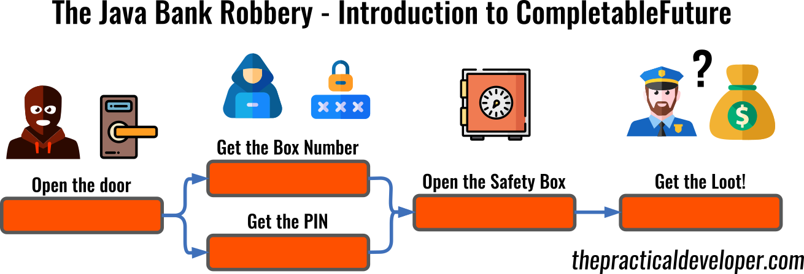

# CompletableFuture, Future and Streams

This project uses a sample use case to compare Java's `CompletableFuture` with plain `Future` and other approaches like plain Java and the Stream API.

There is a story behind this code to make it more fun and, at the same time, to give a goal to the sample code so it's easier to compare. Welcome to the Java Bank Robbery with CompletableFutures, Futures and Streams.

## Blog

The comparison between these approaches, and a good introduction to `CompletableFuture` is available at [The Practical Developer Site](https://thepracticaldeveloper.com/?p=1027). I recommend you to read that guide to follow the codebase.

## Code

The code is split into three main parts:

* The main application class `App`, which runs the different code alternatives and shows the result.
* The `objects` used to represent this story: `Actions`, `Loot` and `Thief`.
* The alternatives used to execute the story:
  * `SingleThreadOpenSafeLock` contains two approaches, both single-threaded: plain, imperative Java and Stream API based.
  * `FutureOpenSafeLock` implements the plan using Java Futures, also in imperative-ish way.
  * `CompletableFutureOpenSafeLock` uses a few important methods of the `CompletableFuture` API to demonstrate how powerful it is to solve composed, multi-threaded problems.

Remember that the conclusions of the comparison are also included in the guide so, [check it out now!](https://thepracticaldeveloper.com/?p=1027)

